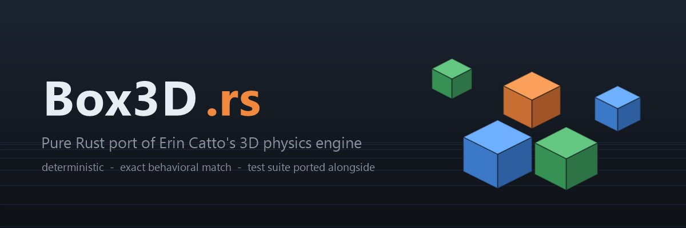

# box3d-rust

A pure Rust port of [Box3D](https://github.com/erincatto/box3d), Erin Catto's 3D physics
engine for games — exact behavioral match, including cross-platform deterministic math.

[](https://crates.io/crates/box3d-rust)
[](https://docs.rs/box3d-rust)
[](LICENSE)
[](https://larsbrubaker.github.io/box3d-rust/)

## Demo Site

**[Follow the port live in your browser](https://larsbrubaker.github.io/box3d-rust/)**

[](https://larsbrubaker.github.io/box3d-rust/)

The demo site mirrors the upstream `samples` app via WebAssembly — same light SPA shell as
our finished [box2d-rust](https://github.com/larsbrubaker/box2d-rust) demos. Collision-layer
demos and rigid-body simulation samples (including the falling-ragdoll determinism scene) are
live in the browser.

> Part of the [rust-apps](https://github.com/larsbrubaker/rust-apps) suite — a collection of
> Rust graphics and geometry libraries by Lars Brubaker.

## Status: Determinism gate passed — bit-exact with the C reference

Box3D was released by Erin Catto in June 2026. The pinned reference source lives in the
`box3d-cpp-reference/` submodule (v0.1.0+, `c52908c`), and this port follows the same
playbook that took [box2d-rust](https://github.com/larsbrubaker/box2d-rust) to completion:
whole modules in dependency order, each landing with its portion of the upstream C test
suite.

| Area | Ported | Tests |
|---|---|---|
| Foundation: math_functions (Vec3/Quat/Matrix3), core/constants | ✅ | ✅ (test_math.c) |
| Foundation: id, bitset, id_pool, table (container → Vec) | ✅ | ✅ (test_id/bitset/table.c) |
| Collision: aabb, distance (GJK/TOI) | ✅ | ✅ (test_collision AABB + test_distance.c) |
| Collision: hull, geometry, manifolds, mesh, height_field, compound, dynamic_tree | ✅ | ✅ (test_hull/shape/compound/height_field + authored) |
| Broad phase: proxy ops, move buffer (pair update deferred to world) | ✅ | ✅ (authored proxy tests) |
| Dynamics: body/shape lifecycle, contact lifecycle, constraint graph, solver sets | ✅ | ✅ (test_body + authored world tests) |
| Dynamics: islands — link, merge, split, sleep/wake | ✅ | ✅ (authored sleep/split tests) |
| Joints: distance, motor, parallel, prismatic, revolute, spherical, weld, wheel | ✅ | ✅ (test_joint.c) |
| Solver: serial contact solve, sub-step pipeline, sleeping, CCD/bullets, sensors, hit events | ✅ | ✅ (test_world.c) |
| Narrow phase: mesh/height-field contacts (mesh_contact.c) | ✅ | ✅ (TestMeshDrop + authored) |
| World API: queries, casts, explode, character mover | ✅ | ✅ (test_body_query.c, test_mover.c) |
| Shape/Body public API (filters, materials, geometry set, per-shape queries) | ✅ | ✅ (test_shape.c, test_body.c) |
| Determinism: bit-exact vs the C scalar build (both precision modes) | ✅ | ✅ (test_determinism.c) |
| Large world mode (`double-precision` feature = `BOX3D_DOUBLE_PRECISION`) | ✅ | ✅ (test_large_world.c) |
| API completeness: introspection accessors, kinematic targets, wind | ✅ | ✅ (WorldTest/BodyTest remainders) |
| Debug draw (b3DebugDraw / b3World_Draw) | ✅ | ✅ (authored) |
| Snapshots and recording/replay | ✅ | ✅ (test_recording.c) |

Not ported (by design): the task scheduler/worker threads (the port is serial), SIMD
codepaths (the scalar `BOX3D_DISABLE_SIMD` path is the behavioral reference), and the C
arena/block allocators (Rust `Vec`s).

## Quick start

```toml
[dependencies]
box3d-rust = "0.3"
# Optional: large-world positions (mirrors BOX3D_DOUBLE_PRECISION)
# box3d-rust = { version = "0.3", features = ["double-precision"] }
```

```rust
use box3d_rust::body::create_body;
use box3d_rust::geometry::Sphere;
use box3d_rust::hull::make_box_hull;
use box3d_rust::shape::{create_hull_shape, create_sphere_shape};
use box3d_rust::types::{default_body_def, default_shape_def, default_world_def, BodyType};
use box3d_rust::world::World;
use box3d_rust::{Pos, VEC3_ZERO};

fn main() {
    let mut world = World::new(&default_world_def());

    let mut ground_def = default_body_def();
    ground_def.type_ = BodyType::Static;
    let ground = create_body(&mut world, &ground_def);

    let mut ball_def = default_body_def();
    ball_def.type_ = BodyType::Dynamic;
    ball_def.position = Pos {
        x: 0.0 as _,
        y: 0.5 as _,
        z: 0.0 as _,
    };
    let ball = create_body(&mut world, &ball_def);

    let shape_def = default_shape_def();
    let ground_hull = make_box_hull(5.0, 0.5, 5.0);
    create_hull_shape(&mut world, ground, &shape_def, &ground_hull.base);

    let mut ball_shape = default_shape_def();
    ball_shape.density = 1.0;
    create_sphere_shape(
        &mut world,
        ball,
        &ball_shape,
        &Sphere {
            center: VEC3_ZERO,
            radius: 0.5,
        },
    );

    // 60 Hz, 1 sub-step
    world.step(1.0 / 60.0, 1);
}
```

## Porting principles

- **Exact behavioral match** — same algorithms, same `f32` arithmetic, same edge cases as the C
  source. Floating-point operations are never reordered or "improved".
- **Determinism preserved** — Box3D's hand-rolled `b3Atan2` and `b3ComputeCosSin` (built for
  cross-platform determinism) are ported bit-for-bit, never replaced with std functions.
- **Tests ported too** — every module lands together with its portion of the C test suite.
- **No stubs** — no `todo!()`, no placeholders; modules are ported whole, in dependency order.
- **Large world mode** — the `double-precision` cargo feature mirrors `BOX3D_DOUBLE_PRECISION`.

The approach follows
[HOW_WE_PORTED_CLIPPER2.md](https://github.com/larsbrubaker/clipper2-rust/blob/main/HOW_WE_PORTED_CLIPPER2.md)
and the completed [box2d-rust](https://github.com/larsbrubaker/box2d-rust) port.

## API style

The public API is a direct C-mirror (same shapes, defs, and call patterns as Box3D /
[box2d-rust](https://github.com/larsbrubaker/box2d-rust)), not a Rust-ergonomic wrapper. A thin
ergonomic layer may be considered later if downstream users ask for one.

## Development

```bash
# Clone with the C reference submodule
git clone --recurse-submodules https://github.com/larsbrubaker/box3d-rust.git

# Run tests (both precision modes)
cargo test
cargo test --features double-precision

# Full pre-commit gauntlet: file lengths, tests, fmt, clippy, build
./scripts/pre-commit-check.ps1   # or .sh
```

### Demo site

The demo site (`demo/`) runs the port in the browser via WebAssembly.

The quickest way to see it — builds the wasm and serves the demo at
`http://localhost:3001`, opening your browser:

```
run_demo.cmd      # Windows (double-click or run from a terminal)
./run_demo.sh     # Linux / macOS
```

Or drive the steps yourself:

```bash
cd demo
bun install
bun run build:wasm   # wasm-pack build (once, and after Rust changes)
bun run dev          # dev server at http://localhost:3001, rebuilds wasm on Rust edits
```

Deployed automatically to GitHub Pages on push to `main`.

## Acknowledgments

- [Erin Catto](https://github.com/erincatto) — Box3D author
- [MatterHackers](https://www.matterhackers.com/) — sponsoring the port
- Ported with [Claude Code](https://claude.com/claude-code)
